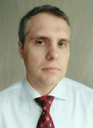

## Mocknachov Dmitry 
Minsk, Belarus  29.11.1980
__**+375296104572**__
 Skype:  dmocknachev   
 e-mail: dimamox@ya.ru
________________________________________
_Work experience:_ 

Feb 2010 – till Jun 2021 	Chief accountant 
 * [Technoserv Bel IOOO (Foreign Limited Liability Company)](https://t1-integration.ru/), a Belarusian subsidiary of the largest Russian system integrator operating Technoserv (Oracle, Cisco, Hitachi, etc.).       
Main responsibilities: accounting, tax, management accounting, accounting and management accounting in SAP for the purpose of operational interaction with financial services (financial department, corporate reports department, budgeting department) to control financial flows.
  I provided accounting services for construction projects of the head company (OOO "TechnoServ AC", Moscow) in the Permanent Mission in Belarus on construction sites since 2011 in the energy sector for a total amount of contracts about 90 million USD: modernization of the infrastructure of the state customer with the supply of equipment (turbine) and installation. 
   Successful result of passing inspections, including my initiative and VAT refund from the budget of Belarus in the amount of 320 thousand USD upon the liquidation of foreign companies represented in Belarus at construction sites. Implementation of projects with major Belarusian customers: building a network for SOOO "Belarusian cloud technologies" (brand beCloud).

* Маy 2009 – Jan 2010	Chief accountant 
Beltransprogress OOO (Limited Liability Company)
Main responsibilities: all responsibilities of a chief accountant, work with the largest retail and wholesale companies of Belarus, services, rent.

* Маy 2008–Май 2009	
Chief accountant
[ALUTECH Group of Companies](https://alutech-group.com).  An-Motors OOO (Limited Liability Company)
  Main functions: accounting, reporting in the structure of the holding, management of the Accounting Department. Improvement of document flow, reporting and terms of its delivery by departments and services, transformation of financial statements into reports on management accounting, application of benefits of FEZ participant.

* Ноv 2006 –Маy 2008	
Chief accountant of several companies (7 companies, 200 people)
Auditing company ["Pravilnaya Kompaniya"](https://erudite.by/)
Main functions: organization and maintenance of accounting. Planning, accounting support of client enterprises, consulting on tax and accounting, data compilation, formation and reporting in the areas of: production, services (incl. service stations), wholesale, retail, commission trade, import, export, representative offices of foreign organizations ("Opel", holding "Grad"). Distance management of accounting departments. Number of subordinates – 20 people. Successfully passed audit and tax inspections.

* Jul 2004 – Ноv 2006	
Chief accountant. Economist.
Jumeirah CHUP (Private Unitary Enterprise), Globalonebel ZAO (Join Stock Company)
Main responsibilities: organization and maintenance of accounting "from cash to taxes".
________________________

_Education_
* Minsk College of Business (2000-2002). Insurance Business. Financier of insurance company.
* Minsk Institute of Management (2002-2004). Banking. Economist.
* Institute for Retraining and Qualification Upgrading of Judges, Prosecutors and Legal Professionals at the Belarusian State University. Lawyer.
__________________________________
_Languages_
* Russian
* English (pre-Intermediate)
___________________
_Skills_
* Chief accountant, manager. 15 years’ work experience
* PC - advanced user (all office Suite, 1C-7, 1C-8, SAP).
* Accounting: IT, production, services, rent, wholesale, retail, commission trade, import, export, representative offices of foreign organizations, FEZ
* Driving experience 20 years
* High ability to self-education, analysis, systematic approach to problem solving, numerate with developing analytical skills.
________________________________
_Hobbies_

* running
* boxing
________________________________
Married, two children
Nationality: Republic of Belarus
